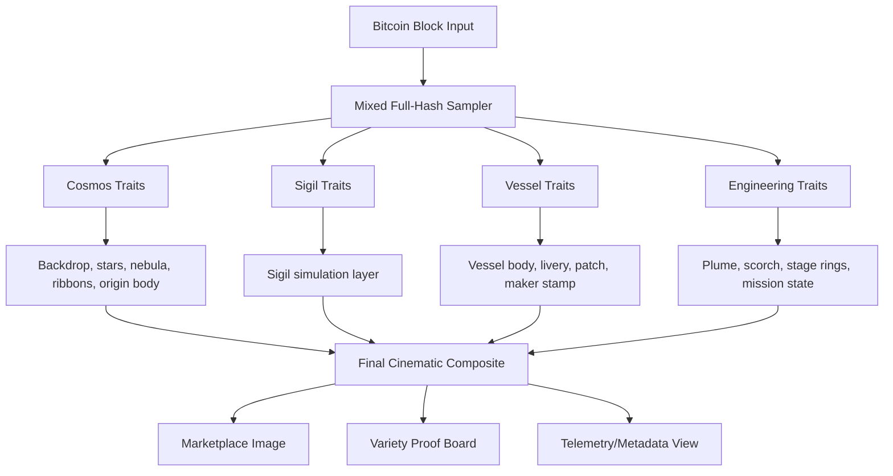

# NATSHIPS Visual Guide (Blastoff + Variety)

This guide explains exactly how the NATSHIPS cinematic system works, how it aligns with DMT, and how to present it on nat.fun using the same element strategy as Hi Imprints.

## Triple-Checked Facts

1. DMT element is blastoff
- Verified from public tokenomics copy on takedmt.com:
- "Element: blastoff"

2. Variety coverage is complete
- Current trait system covers all intended categorical states:
- fleets 32/32, classes 5/5, propulsion 5/5, engines 6/6, orbits 7/7, statuses 5/5,
  origins 4/4, stages 3/3, flights 24/24, nebula 12/12, stars 5/5, sigil modes 4/4.

3. Showcase uniqueness is real
- Real 5-block proof now maps to clearly different signatures after entropy-mixer fix.
- Full 10,080 audit model yields 10,080 unique categorical signatures in sample.

## What Viewers See vs What DMT Proves

| Layer | Viewer Experience | DMT Proof |
|---|---|---|
| Cinematic sky | Awe, mood, nostalgia, atmosphere | Nebula, stars, ribbons, sigil all derive from block hash |
| Hero vessel | Identity, swagger, mission feel | Fleet/class/engine/stage/orbit/status are deterministic |
| Signature details | Distinct collectible personality | Call sign, patch geometry, livery, maker mark are deterministic |
| Metadata panel | Understandable technical recap | Full trait disclosure + reproducibility |

## Blastoff Integration Strategy

Use blastoff as a recurring in-world physics language, not as a pasted UI logo.

1. Sigil simulation in scene
- Ring + spokes + nodes + orange core motif appears as a cosmological artifact.
- Variation modes: ghost, beacon, engraved, constellation.

2. Blastoff as motion grammar
- Engine plume states and trajectory mood communicate launch energy.
- Status states distinguish pre-launch, active ascent, orbital settlement, and return.

3. Blastoff in naming and captions
- Frame your public text as ignition language:
- "Forged from chain matter. Built to blast off and return."

## Render Pipeline

## Trait Variation Map

### A. Cosmos (matter field)
- Nebula family: 12
- Star palette: 5
- Orbital ribbons: procedural count and geometry
- Origin body: EARTH, MARS, MOON, SUBSTRATE
- Sigil mode: 4
- Sigil intensity: continuous
- Sigil tilt: continuous
- Dust and haze: continuous

### B. Vessel (identity field)
- Fleet: 32
- Class: 5
- Call sign: fleet + height-derived code
- Hull livery and finish: deterministic
- Mission patch geometry: 3-8 polygon family
- Maker mark: fixed concept, deterministic placement

### C. Engineering (behavior field)
- Engine count bucket: 3,5,7,9,27,33
- Propulsion + fuel pair: 5
- Stages: 1-3
- Orbit class: 7
- Status: 5
- Flight count: 1-24
- Payload and delta-v: continuous

## Why This Showcases DMT Uniqueness

1. Not only the object is deterministic, the environment is deterministic.
2. Blastoff is encoded as matter behavior and symbol behavior, not just text branding.
3. Emotional readability is immediate, technical legitimacy is inspectable.
4. The same engine yields broad variation without manual styling per piece.

## 5-Block Proof Narrative (Current Board)

- 102,816: early-era launch spirit, high-flight energy profile
- 420,000: memetic midpoint with distinct vessel and sigil mode
- 630,000: halving-era gravity with different class/engineering state
- 701,824: control reference for continuity and tuning
- 810,000: modern-era profile with different origin and status

## nat.fun Posting Blueprint (same element model)

1. Keep element naming consistent with DMT framing:
- Element: blastoff

2. Upload order
- Hero still first (single strongest 1500x1500)
- Then the 5-block variety board crops
- Then optional telemetry explainers as follow-up slides

3. Caption formula
- Line 1: emotional hook
- Line 2: deterministic claim
- Line 3: short trait highlight for the specific piece

Example:
- Ships forged from the chain.
- Sky + vessel + sigil all derived from one Bitcoin block.
- Fleet GORGON, Nimbus-class, Breakthrough Aurora, Sigil: ghost.

## Current Implementation Surfaces

- Hero prototype: prototypes/merged-v1.html
- Variety board: prototypes/variety-v1.html
- Trait spec: TRAITS.md

## Next Upgrade (Recommended)

Add a proof overlay toggle for pitch demos:
- Off: pure cinematic art
- On: small corner callouts for 6 core traits

This keeps first impression emotional while proving non-arbitrary structure instantly when needed.
